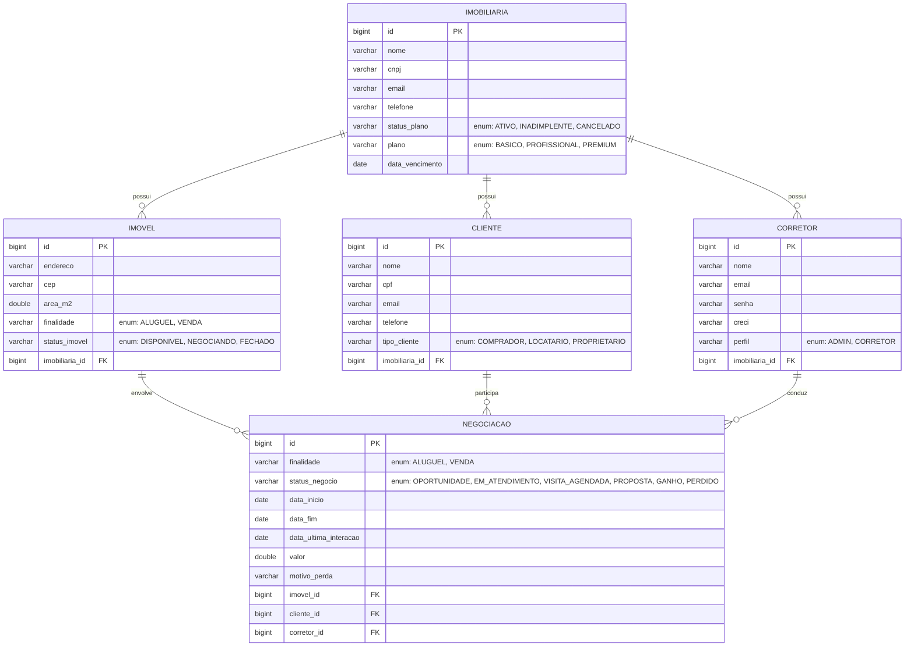

# Modelagem do Banco de Dados — Imob

Banco: **PostgreSQL** · ORM: **Spring Data JPA / Hibernate**

## Diagrama ER

## Relacionamentos

| De | Para | Cardinalidade | Observação |
|----|------|---------------|------------|
| Imobiliaria | Corretor | 1 : N | Um corretor pertence a uma imobiliária |
| Imobiliaria | Cliente | 1 : N | Um cliente pertence a uma imobiliária |
| Imobiliaria | Imovel | 1 : N | Um imóvel pertence a uma imobiliária |
| Imovel | Negociacao | 1 : N | Um imóvel pode ter várias negociações |
| Cliente | Negociacao | 1 : N | Um cliente pode ter várias negociações |
| Corretor | Negociacao | 1 : N | Um corretor conduz várias negociações |

